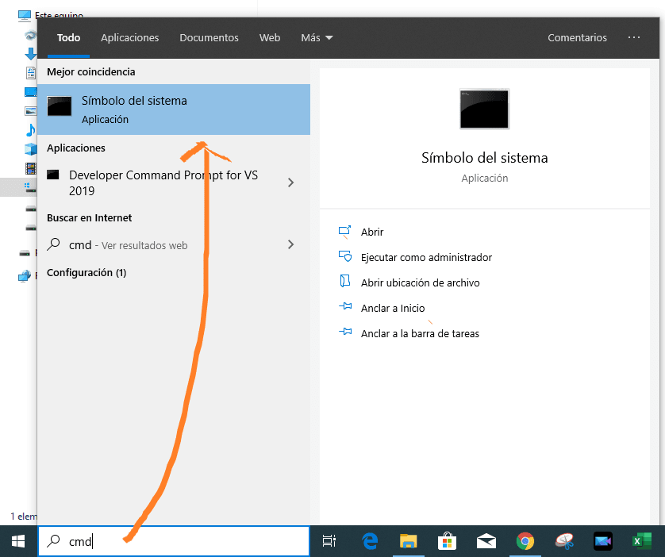
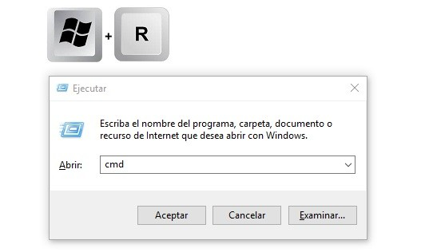
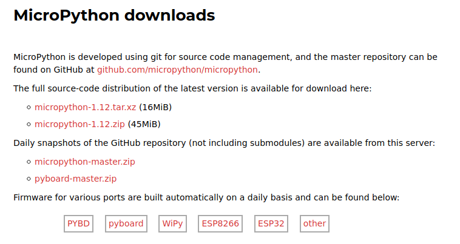
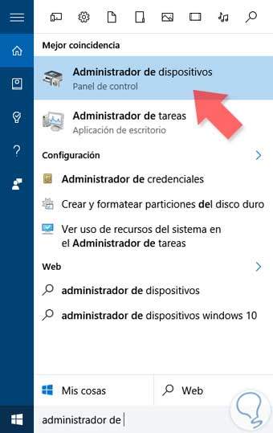
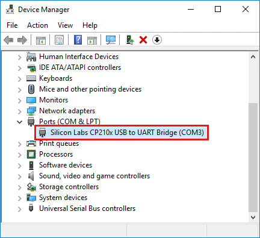
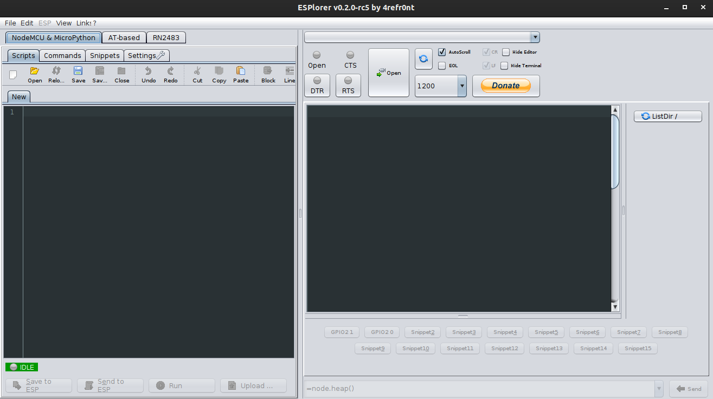
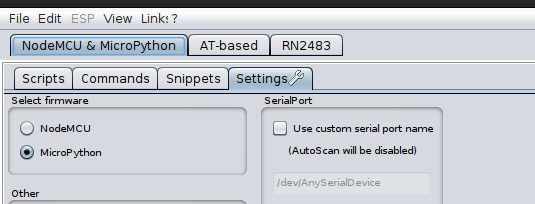
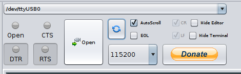
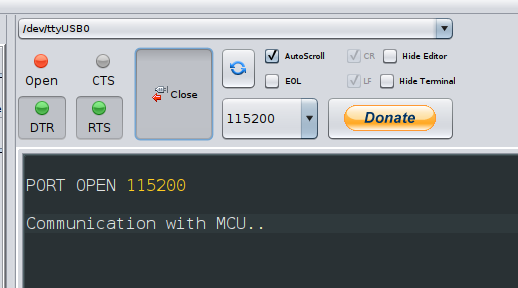
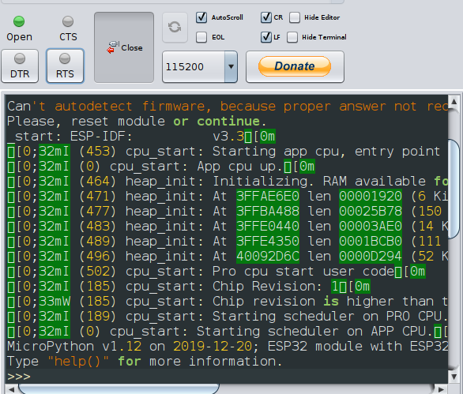

# Empezando con micropython

## Windows

1. Instalar python version 3:

    https://www.python.org/downloads/windows/

2. Marcar la casilla agregar al PATH durante la instalación e instalar normalmente:

3. Luego a instalar python se deben instalar unos paquetes de python usando pip:

Enlace a sus repositorios

* [esptool](https://github.com/espressif/esptool/)
* [ampy](https://github.com/pycampers/ampy)

4. Abrimos la cmd (hay dos formas de hacerlo, con el teclado o buscando en menú de inicio):

 
 

5. Usamos el sigueinte comando para instalar esptool(nos permite flashear el firmware de MicroPython en la tarjeta):

`pip3 install esptool
`

6. Usamos el siguiente comando para instalar ampy (nos permite grabar y borrar los scripts):

`pip3 install adafruit-ampy
`

### Cargar "flashear" el firmware en el microcontrolador

1. Descargar el binario de la pagina de micropython dependiendo de tu dispositivo:
Pyboard, ESP32, ESP8266, WiPy u otro:

    https://micropython.org/dowmloads

 

2. Conectar el USB y abrir el administrador de dispositivos de windows y verificamos el número de puerto COM:

 
 

3. Abrir la terminal CMD y con el sig comando borrar el flash del microcontrolador:

`esptool.py erase_flash
`

en algunas versiones el comando va sin el .py

`esptool erase_flash
`

4. Vamos a grabar el binario en el microcontrolador:

Antes de usar este comando se debe cambiar el puerto **COMx** y al final ponemos la ruta de nuestro binario, generalemte esta en descargas.

`esptool.py --chip esp32 --port COMx --baud 460800 write_flash -z 0x1000 (ruta del binario)
`

**Ejemplo:** si bajé el binario **esp32-firmware.bin** en descargas, y mi dispositivo esta en el **puerto COM8**.

`esptool.py --chip esp32 --port COM8 --baud 460800 write_flash -z 0x1000 C:\Users\Descargas\esp32-firmware.bin`

### Instalar prerequisitos para el IDE ESPlorer

1. Instalar Java:

    https://www.java.com/es/download/

2. Descargar ESPlore y descomprimir:

    http://esp8266.ru/esplorer-latest/?f=ESPlorer.zip

> ESPLORER será el IDE para programar el esp32 con micropython

## Probando MicroPython

1. Abrimos el ejecutable ESPLorer

 

>En la parte izquierda podemos escribir nuestro código, y en la parte izquierda ver por serial los mensajes que nos envia nuestro dispositivo.

2. En la pestaña SETTINGS marcar la casilla "micropyhon":

 

3. Cambiamos la velocidad a 115200 y damos clic en OPEN para abrir el puerto:

 

4. Doble clic en RTS para resetear el chip (el el primer clic se hara verde, en el segundo click se hara gris) y saldran mensajes por serial o podemos pulsar el boton de la tarjeta y veremos micropython en nuestra consola:

 

## Recursos extras (próximamente con videos)

* [SISTEMAS DE ARCHIVOS CON AMPY](https://github.com/FunPythonEC/Python_para_MicroControladores/blob/master/Sistema_de_archivos.md)(como si se tratara de un pendrive, copiar, pegar, borrar archivos y carpetas)

* [INSTALANDO LIBRERIAS USANDO uPIP](https://github.com/FunPythonEC/Python_para_MicroControladores/blob/master/Instalar_librerias.md) (es como el  PIP que conocemos pero más pequeño)

* [EJEMPLOS CON ESP8266/ESP32](https://github.com/FunPythonEC/Python_para_MicroControladores/blob/master/ejemplos.md) (proximamente video)
