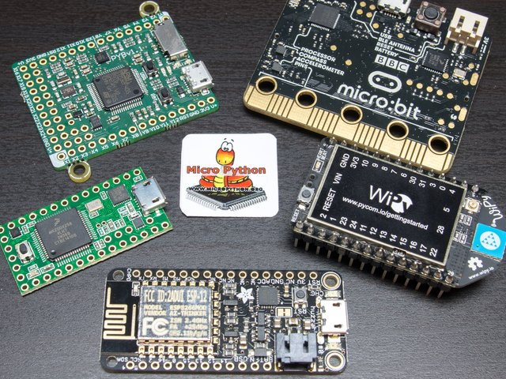
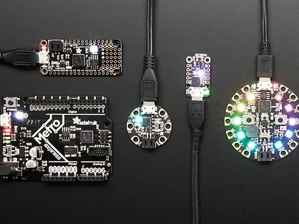

# Python para microcontroladores

Python es un lenguaje poderoso y popular en 2019 encabezó el top 10 de lenguajes de programación.

</img> 

Se usa espcialemte en el desarrollo de inteligencia artifical, ciencia de datos tambien desarrollo web con su framekork Django, entre otras aplicaciones pero los microcontroladores no podian quedarse atrás, con sus principales implemntaciones: [MicroPython](https://micropython.org/) y [CircuitPython](https://circuitpython.org/), tener un interprete en un microcontrolador fue posible gracias al desarrollo de hardware cada dia mas potente.

## MicroPython

</img> 

Micropython es una implementacion ligera de python3 ,esta escrita en C, fue creado por el fisico y programador Damien George en 2014 gracias a una exitosa campaña en [Kickstarter](https://www.kickstarter.com/projects/214379695/micro-python-python-for-microcontrollers), junto a la Pyboard, la placa oficial de micropython, desde entonces se ha portado a diferentes plataformas.

</img> 

TARJETA	| CHIP | ORGANIZACIÓN | CARACTERISTICAS
--------|------|----------------------|----------------
PYBOARD | STM32 | MICROPYTHON | 24 PINES MULTIPROPOSITO, ACELEMETRO, MICRO-USB, MICRO-SD
ESP8266 | XTENSA L106 | ESPRESSIF | WIFI, 32-BIT NUCLEO UNICO, 17 GPIO
ESP32   | XTENSA LX6 | ESPRESSIF | WIFI, BT, 32-BIT DOBLE NUCLEO, 36 GPIO
MICRO:BIT| nrf51822 | BBC | BT, MICRO-USB, 20 GPIO, COMPAS, ACELEROMETRO, MATRIZ LED, CONECTOR BATERIA
LOPY4| ESP32 | PYCOM | 32-BIT, LORA, WIFI, BLE, SIGFOX, 24 GPIO, CARGADOR LIPO INTEGRADO
IGLOO2 FPGA | Mi-V RV32 | MICROSEMI | 32-BIT RISC-V, iNTERFACES: PCI Express, ETERNET GIGABYTE, JTAG/SPI, SMA
MAIX-M1 | K210 | SIPEED | 64-BIT RISC-V DOBLE NUCRO, COPROCESADOR ESP8265, KPU (Neural Network Processor), ACELERADOR AES, FFT, UART, SPI, I2S, PWM, ETC. 
PORTENTA H7 | STM32H747 | ARDUINO | CORTEX M7 Y M4 32-BIT, ACELERADOR GRÁFICO, WIFI, BT, CONECTORES DE ALTA DENSIDAD, USB-C

## CircuitPython

CircutPython es una versión de MicroPython creada en 2017 para Adafruit por Scott Shawcroft con el objetivo de usarlo en las tarjetas de la compañia basadas en el SAMD21 de MicroChip anteriormente Atmel. Circuipython quiera una versión de micropython más sencilla de usar dedicada para principantes y estudiantes. A inicios del 2019 CircuiPython soportaba 30 tarjetas:

</img> 

* Tarjetas CircuitPython de Adafruit – Adafruit Circuit Playground Express, Adafruit Feather M0 Express, Adafruit Feather M4 Express, Adafruit Feather nRF52840 Express, Adafruit GEMMA M0, Adafruit Grand Central M4 Express featuring the SAMD51, Adafruit HalloWing M0 Express, Adafruit ItsyBitsy M0, Adafruit ItsyBitsy M4, Adafruit METRO M0 Express, Adafruit Metro M4, Adafruit NeoTrellis M4, Adafruit Trinket M0.
* Arduino – Arduino MKR 1300, Arduino MKR ZERO, Arduino ZERO.
* Electronic Cats – CatWAN USB Stick, Meow Meow.
* MakerDiary – nRF52840 Micro Dev Kit USB Dongle.
* Mini Sam – Mini SAM development board.
* Nordic Semiconductor – nRF52840 DK board PCA10056, nRF52840 dongle PCA10059.
* Particle – Particle Argon, Particle Boron, Particle Xenon.
* SparkFun – SparkFun Pro nRF52840 Mini – Bluetooth devkit, SparkFun SAMD21 Mini Breakout, SparkFun SAMD21 Dev Breakout. Sparkfun LumiDrive LED Driver, y SparkFun RedBoard Turbo – SAMD21 devkit.

</img> 
