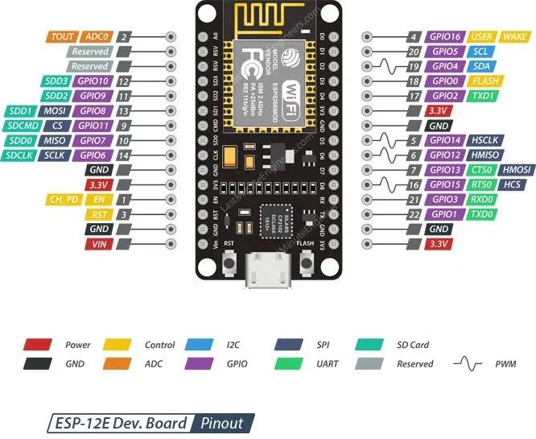

# Empezando con micropython en ESP8266/32

 

 

# Acceso a pines

## SALIDAD DIGITAL  (leds, reles)

```py
from machine import Pin

pin = Pin(0, Pin.OUT)

# hay dos variantes para cambiar el estado
# con on/off y con 1/0

pin.on()             
pin.off()

pin.value(1)    
pin.value(0)    
```

## ENTRADA DIGITAL (botones)

```py
from machine import Pin

pin = Pin(2, Pin.IN) 

#para imprimir y leer el valor del pin
print(pin.value())  
```
 
## Modulación por ancho de pulsos - PWM (pulse width modulation)

```py
from machine import Pin, PWM

pwm = PWM(Pin(0))      # Creamos el pin PWM
pwm.freq(1000)         # establecemos la frecuencia
pwm.duty(200)          # establecemos el ciclo de trabajo

pwm.deinit()           # apagamos el pin PWM
```
Para crear y configura el pin en un solo paso

```py
from machine import Pin, PWM

pwm = PWM(Pin(0), freq=20000, duty=512) 
```
## Conversor Analógico Digital - ADC (analog to digital conversion)

```py
from machine import ADC

adc = ADC(Pin(32))
adc.read()
```
## I2C

Hay dos formas de usar el bus I2C en los ESPXX:

SPI por hardware (cuando usamos los pines definidos como SDA y SCL del ESP para esta función)

```py
from machine import Pin, I2C

i2c = I2C(0)
i2c = I2C(1, scl=Pin(5), sda=Pin(4), freq=40000)
#escaneamos nuestros sensores
i2c.scan()  
```
SPI por software(cuando usamos pines diferentes de nuestra tarjeta)

```py
from machine import Pin, I2C

i2c = I2C(scl=Pin(5), sda=Pin(4), freq=100000)
#escaneamos nuestros sensores
i2c.scan()  
```

NEOPIXEL leds programables


```py
from machine import Pin
from neopixel import NeoPixel

#establecemos el número del pin GPIO la que estan los leds
#establememos la cantidad de leds que hay

pin = Pin(0, Pin.OUT)   
np = NeoPixel(pin, 8)   

#para encender un led es necesario indicar la posición de este

np[0] = (255, 255, 255) 

#con np.write actualizamos los leds
np.write()   
```

ejemplo con un for para encender varios leds de una tira neopixel

```py
num_leds=10
pin_salida=15
np = neopixel.NeoPixel(machine.Pin(pin_salida), num_leds)

for led in range(num_leds):
    np[led]=(255,0,0)
np.write()        
              
```

WiFi conexión robusta

```py
#CONEXION A LA RED WIFI
# Informacion de la red WiFi
WIFI_SSID = ''
WIFI_PASSWORD = ''

# apagar el punto de acceso WiFi
ap_if = network.WLAN(network.AP_IF)
ap_if.active(False)

# conecta el dispositivo a la red WiFi
wifi = network.WLAN(network.STA_IF)
wifi.active(True)
wifi.connect(WIFI_SSID, WIFI_PASSWORD)

# esperar hasta que el dispositivo esté conectado a la red WiFi
MAX_ATTEMPTS = 20
attempt_count = 0

while not wifi.isconnected() and attempt_count < MAX_ATTEMPTS:
    attempt_count += 1
    time.sleep(1)
    print('conectando a la red WiFi...')
    
if attempt_count == MAX_ATTEMPTS:
    print('no se pudo conectar a la red WiFi')
    sys.exit()
    
print('conectado a la red WiFi')
print ("Configuracion de red: ", wifi.ifconfig())
```